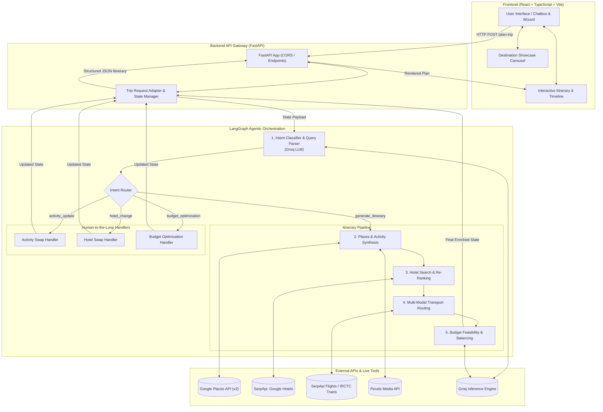

# Beyond 🌍✈️
> **Autonomous Agentic AI Travel Planner for Dynamic, End-to-End Itinerary Generation**

[](https://react.dev/)
[](https://www.typescriptlang.org/)
[](https://fastapi.tiangolo.com/)
[](https://langchain-ai.github.io/langgraph/)
[](https://python.org)
[](https://tailwindcss.com/)

---

## 📖 Overview

**Beyond** is an autonomous, AI-driven travel planning and exploration platform designed to craft personalized, realistic, and budget-conscious itineraries across India. 

Rather than generating generic or hallucinated itineraries, Beyond orchestrates a stateful **LangGraph multi-agent architecture** powered by **Groq LLMs**. The system coordinates specialized agents that interact directly with live external APIs—discovering verified attractions via **Google Places API**, retrieving live rates from **SerpApi (Google Hotels)**, routing multi-modal transit (Flights, IRCTC Trains, and Buses), and mathematically enforcing budget feasibility in real time.

Paired with a modern React frontend featuring animated carousels, destination previews, and a dynamic chat assistant, travelers can explore curated destinations and refine their trips on the fly through conversational human-in-the-loop iteration.

---

##  Key Features

- **🤖 Multi-Agent Orchestration (LangGraph)**  
  Stateful generation pipeline combining intent classification, landmark synthesis, live hotel search, multi-modal transport routing, and budget validation.

- **📍 Grounded Landmark Discovery**  
  Uses Google Places API (New) combined with rich Indian tourism datasets to pull verified places, visitor timings, and authentic descriptions tailored to the traveler's pace.

- **🏨 Real-Time Accommodation & Reranking**  
  Direct SerpApi integration with Google Hotels and vacation rentals. Candidates are reranked against traveler mood and preferences using TF-IDF cosine similarity.

- **🚆 Multi-Modal Transit Intelligence**  
  Resolves airport IATA codes and railway station codes to fetch realistic flight fares (Google Flights) and train schedules (IRCTC) alongside road transit options.

- **💰 Autonomous Budget Feasibility Agent**  
  Eliminates arbitrary percentage floors. Mathematically validates expenses against live market rates, identifies shortfalls, and recommends realistic cost-saving trade-offs.

- **🔄 Conversational Human-in-the-Loop Refinement**  
  Travelers can swap specific activities, adjust hotel tiers, or replan budget splits directly through an integrated natural language chatbox.

---

## 🏗️ System Architecture



---

## 📁 Repository Structure

```text
Beyond/
├── Backend/
│   ├── agents/
│   │   ├── planner_agent.py      # LangGraph state machine & itinerary pipeline
│   │   └── budget_agent.py       # Autonomous budget allocation & feasibility agent
│   ├── Tools/
│   │   ├── google_places.py      # Google Places API (New) integration
│   │   ├── hotel_search.py       # SerpApi Google Hotels + TF-IDF reranker
│   │   └── transport_search.py   # Flights (SerpApi) & IRCTC train search
│   ├── Data/
│   │   ├── india_tourism_dataset.json  # Regional attractions & culture data
│   │   └── destination_names.txt       # Indexed destination mapping
│   ├── adapters.py               # Request/Response schemas & state mapping
│   ├── api.py                    # FastAPI server & route handlers
│   ├── general_planner.py        # Dataset-powered fallback & enrichment engine
│   └── requirements.txt          # Python backend dependencies
│
├── Frontend/
│   ├── src/
│   │   ├── components/
│   │   │   ├── BuildTripPage.tsx # Chat interface & quick filter selectors
│   │   │   └── Carousel.tsx      # Destination showcase carousel
│   │   ├── services/
│   │   │   └── api.ts            # Frontend HTTP client for FastAPI backend
│   │   ├── types.ts              # TypeScript domain types & interfaces
│   │   ├── App.tsx               # Main application shell, wizard, & routing
│   │   └── main.tsx              # Application entry point
│   ├── package.json              # Frontend scripts & dependencies
│   ├── vite.config.ts            # Vite bundler configuration
│   └── tsconfig.json             # TypeScript compiler configuration
│
└── README.md
```

---

## 🛠️ Getting Started

### Prerequisites
- **Node.js** (v18+ recommended)
- **Python** (v3.10+ recommended)
- Git

### 1. Environment Configuration

Create a `.env` file inside the `Backend/` directory:

```env
# Groq LLM
Groq_api_key=your_groq_api_key

# Google Places API
Google_places_api=your_google_places_api_key

# SerpApi (Google Hotels & Flights)
serp_hotel_api=your_serpapi_key
SERP_API_KEY=your_serpapi_key

# RapidAPI (IRCTC Train search)
RAPIDAPI_KEY=your_rapidapi_key

# Pexels (Media asset fallbacks)
pexels_api=your_pexels_api_key
```

---

### 2. Backend Setup

From the project root:

```bash
# Navigate to Backend
cd Backend

# Create and activate a virtual environment
python -m venv .venv
# On Windows:
.venv\Scripts\activate
# On macOS/Linux:
# source .venv/bin/activate

# Install dependencies
pip install -r requirements.txt

# Start the FastAPI server
uvicorn api:app --reload --port 8000
```

The API will be available at `http://127.0.0.1:8000` (interactive Swagger documentation at `http://127.0.0.1:8000/docs`).

---

### 3. Frontend Setup

In a separate terminal window:

```bash
# Navigate to Frontend
cd Frontend

# Install npm dependencies
npm install

# Start development server
npm run dev
```

The application will launch at `http://localhost:5173`.

---

## 🔌 API Endpoints Reference

| Method | Endpoint | Description |
|---|---|---|
| `GET` | `/health` | Service health check and dependency status |
| `POST` | `/plan-trip` | Triggers the complete LangGraph itinerary generation pipeline |
| `POST` | `/chat-plan` | Conversational modifications (hotel swaps, activity updates, budget optimization) |
| `POST` | `/swap-alternatives` | Fetches candidate replacement attractions with images |
| `POST` | `/apply-optimization` | Recalculates and persists applied budget/stay adjustments |
| `GET` | `/saved-itinerary` | Retrieves the most recently persisted session plan |

---

## 👩‍💻 Author

**Pratishtha Sharma**  
- Portfolio / Contact: Pratishtha  
- Project: Beyond Travel Technologies  
